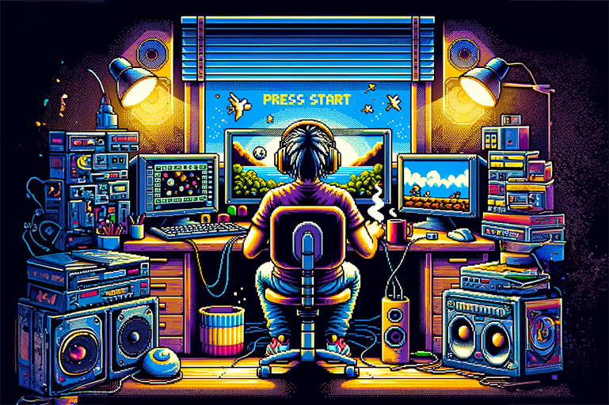

# Hello 👋! I'm Marmik Shah! 👨‍💻🚀

 
   

---

## ✨ About Me
- 💼 Previously worked as Senior Computer Vision Engineer @ [Sebit](https://sebit.world)
- 💼 Former Machine Learning Engineer @ [EMOS](https://emos.ai)
- 🎓 M.Sc. Info Tech & B.Sc. Info Tech
- 🤖 Deep Learning | 🖼️ Computer Vision | 🎛️ MLOps
- 🌐 Exploring Generative AI & Reinforcement Learning.

## My Projects
- [Artium](https://apps.apple.com/us/app/artium/id1470388292): Fast Neural Style Transfer on-device. 
- [Speed Master](https://apps.apple.com/us/app/speed-master-typing-test/id1037575794) Simple typing speed test app. (Stopped support since 2019)

## Tech Stack

  <h3>Languages</h3>
  
  
  
  
  
  
  

  <h3>Tools and Libraries</h3>
  
  
  
  
  
  
  
  
  
  
  
  
  

## Connect With Me

- 📧 [marmikshah@icloud.com](mailto:marmikshah@icloud.com)
- 🔗 [LinkedIn](https://www.linkedin.com/in/shahmarmik/)
